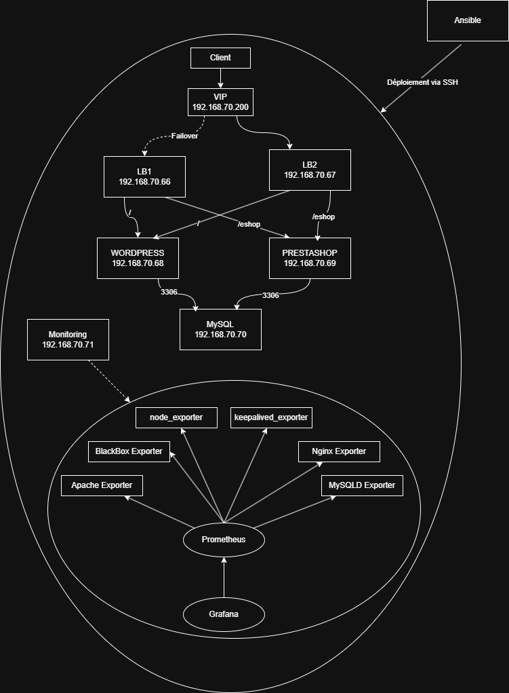

# Ansible DunderMifflin

## Schéma de l'infrastructure



## Prérequis

* Un environnement Linux (ou Windows avec WSL) avec Python installé.
* Installer les dépendances Python via pip, depuis le fichier `requirements.txt` :

  ```sh
  pip install -r requirements.txt
  ```
* Un utilisateur Linux identique sur toutes les machines cibles, disposant des droits sudo **sans mot de passe**.
* La clé SSH de cet utilisateur doit être déployée et autorisée sur tous les serveurs distants.

---

## Installation

### Déploiement des services et du monitoring

Pour lancer le déploiement complet (installation et configuration des services, exporters Prometheus, etc.) :

```sh
ansible-playbook -i inventory.yml deploy.yml
```

Ce playbook installe et configure automatiquement tous les composants nécessaires sur les hôtes définis dans `inventory.yml`.

---

## Maintenance

Pour appliquer des tâches de maintenance, mises à jour ou modifications ponctuelles :

```sh
ansible-playbook -i inventory.yml maintenance.yml
```

Ce playbook permet de maintenir votre infrastructure à jour sans perturber les services.

---

## Structure du projet

* `inventory.yml` : liste des hôtes et groupes cibles.
* `deploy.yml` : playbook principal de déploiement.
* `maintenance.yml` : playbook pour les opérations de maintenance.
* `roles/` : répertoires contenant les rôles Ansible modulaires (ex: keepalived\_exporter, mysql\_exporter, etc.).
* `requirements.txt` : dépendances Python nécessaires pour Ansible et modules additionnels.
